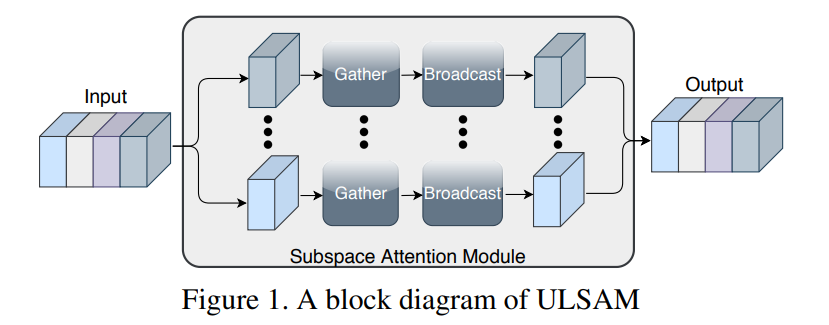
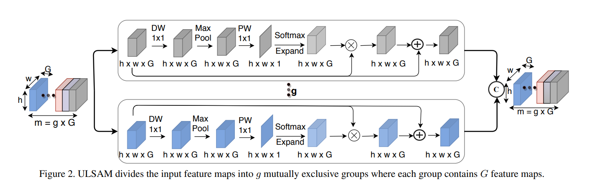

<h1>Beginner's Hypothesis 2025</h1>

<h2 id="introduction">Introduction</h2>

This project utilizes the ULSAM model and MobileNet model for image classification and recognition tasks. ULSAM (Ultra-lightweight Semantic Aggregation Model) and MobileNet are efficient deep learning architectures designed for lightweight and scalable model deployment.

<!-- First Image -->

  

<strong>Block Diagram of ULSAM</strong>

  

<strong>In-Depth Structure of ULSAM</strong>

<h2 id="usage">Usage</h2>
<ul>
  <li>Run the Streamlit App by navigating to the project directory and executing:
    <pre><code>streamlit run main.py</code></pre>
  </li>
  <li>Alternatively, visit the deployed site:
    <a href="https://beginnerhypothesis-satyam.streamlit.app/">https://beginnerhypothesis-satyam.streamlit.app/</a>
  </li>
</ul>

<h2 id="installation">Installation</h2>
<ol>
  <li><strong>Clone the repository</strong>:
    <pre><code>git clone https://github.com/your-repo/ULSAM-MobileNet.git</code></pre>
  </li>
  <li><strong>Navigate to the project directory</strong>:
    <pre><code>cd ULSAM-MobileNet</code></pre>
  </li>
  <li><strong>Set up a virtual environment</strong>:
    <pre><code>python -m venv venv</code></pre>
    
For Linux/Mac:
      <pre><code>source venv/bin/activate</code></pre>
    

    
For Windows:
      <pre><code>.\\venv\\Scripts\\activate</code></pre>
    

  </li>
  <li><strong>Install dependencies</strong>:
    <pre><code>pip install -r requirements.txt</code></pre>
  </li>
</ol>
